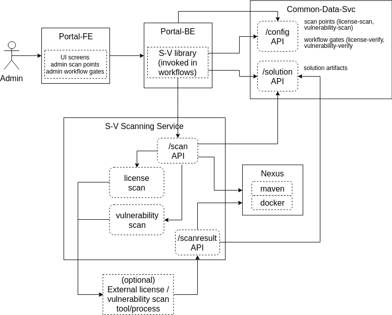

.. ===============LICENSE_START=======================================================
.. Acumos CC-BY-4.0
.. ===================================================================================
.. Copyright (C) 2017-2018 AT&T Intellectual Property & Tech Mahindra. All rights reserved.
.. ===================================================================================
.. This Acumos documentation file is distributed by AT&T and Tech Mahindra
.. under the Creative Commons Attribution 4.0 International License (the "License");
.. you may not use this file except in compliance with the License.
.. You may obtain a copy of the License at
..
.. http://creativecommons.org/licenses/by/4.0
..
.. This file is distributed on an "AS IS" BASIS,
.. See the License for the specific language governing permissions and
.. limitations under the License.
.. ===============LICENSE_END=========================================================

=================================================
Acumos Security-Verification Design Specification
=================================================

This document describes the design for the Acumos platform Security-Verification
component and related capabilities. This component will be delivered in the
Boreas release.

-----
Scope
-----

The Security-Verification component (referred to here as S-V) addresses the
following goals of the Acumos project, as outlined by the
`Acumos TSC Security Committee <https://wiki.acumos.org/display/SEC>`_:

* models and related metadata that are contributed to an Acumos platform and
  distributed through a federated ecosystem of Acumos platforms must be
  verified to the extent possible, as

  * contributed under clear and compatible open source license(s)
  * free from security vulnerabilities

This in turn is based upon the
`bylaws of the Acumos project <https://www.acumos.org/wp-content/uploads/sites/61/2018/03/charter_acumos_mar2018.pdf>`_
which include the following responsibilities as described in section 2.i.vii

.. code-block:: text

  vii. establishing: (1) a vetting process for maintaining security and integrity of
  new and/or changed code and documentation, including vetting for
  malicious code and spyware and (2) a security issue reporting policy and
  resolution procedure;
..

The above bylaws apply to both the Acumos platform code and the federated
ecosystem of Acumos platform instances and models (referred to also as
"solutions" here) distributed through them. This document addresses the
Acumos project support for the latter goal.

Note that for license scanning, the S-V service is focused on the presence and
appropriateness of model license, as they related to the policies of the
Acumos platform operator. The S-V service is not specifically designed to verify
other potential "licensing" concerns, such as the RTU (right to use) of the user
for a model, as would be governed by a license contract between a model supplier
and model user. Those concerns go beyond the verification of a license as
provided by the model supplier, as a simple expression of the terms under which
that model is made available to users. The two purposes may share common
concepts and controls as provided by the Acumos platform, but this design only
addresses the former concern.

The S-V service will be scoped to address the essential concerns that we have
the resources and technology to address in an open source context. Beyond that,
Acumos community policies and offline practices will need to address the rest.
Following is a short list of some potential concerns, not all of which may be
considered of essential focus for machine-learning models which are collaborated
upon and distributed through a federated ecosystem such as Acumos. Acumos
community discussions will be used to determine which concerns we should put
in scope for implementation.

* Vulnerabilities in solutions and metadata distributed with those solutions
  including real/demo applications of the solutions, test data, documentation,
  etc. Such vulnerabilities can range across the following example set of risk
  categories, which can be viewed as "soft risks" (things which can be used by
  bad actors to increase risks) and "hard risks" (things which represent overt
  malicious risks, when embedded in the solutions and metadata):

  * soft risks, such as bad coding/documentation practices, e.g.

    * incluson of sensitive personal information (SPI) about real individuals,
      assumed to be a risk mostly in test data
    * inclusion of real system addresses or API URLs, along with credentials
      providing access to those systems/APIs
    * unprotected, potentially sensitive APIs
    * code quality issues that can result in unreliable behavior or create
      attack opportunities

  * hard risks, such as

    * malicious or compromised design in software components, either overt or
      inadvertent (e.g. by compromised/malicious code reuse, or importation),
      enabling e.g.

      * host system hacking
      * intrusion behavior, e.g. host/port probing
      * network behavior outside expected norms (e.g. for models, network
        behavior other than serving protobuf interfaces)
      * DDOS/botnets
      * creation of backdoors

    * known threats, e.g. viruses, trojans, etc as embedded in binaries,
      documents, rich media, etc

* Unclear, incomplete, incorrect, or incompatible licenses and/or copyright
  attribution

  * soft risks

    * lack of trust, inhibiting adoption of the solutions
    * perpetuating bad licensing/attribution practices

  * hard risks

    * unclear liabilities, e.g. due to

      * inclusion of undisclosed, GPL-family licensed code or other licenses
        with specific use-limitations or reservations
      * failure to properly license or attribute included solution software, or
        metadata (e.g. source code, documentation, test data, rich media, etc)

......................................
Implementation Approach Considerations
......................................

Given the importance of managing risks such as above, the key question is how
that capability needs to, or can be, implemented. This design assumes that the
goal of the S-V component of the Acumos platform is to provide a comprehensive,
as-much-automated-as-possible, platform-integrated service that fulfills the
goals. Thus the design below attempts to lay out an approach to that. This
design however may not be achievable in a single release or in full, since:

* project resource may be insufficient
* technical solutions to some of the goals may be unavailable, e.g.

  * machine-learning technologies are fairly new, and ability
    to detect malicious design in compiled models (e.g. in pickle files) may be
    limited technically
  * when compared to signatures of well-known or new threats to host systems or
    consumer devices (e.g. PCs) as supported by open source virus/malware scan
    tools, there may be limited experience thus limited libraries of threat
    signatures for compiled ML models

Thus alternate/fallback implementation approaches are described below, so that
as much of the goals as possible can be delivered in the Athena release, or as
soon as possible after Athena. These alternate approaches are based upon the
following assessments of how the bylaws goals related to potential implementation
approaches, such as:

* a comprehensive, as-much-automated-as-possible, platform-integrated service

  * this is the stated default approach, given that resources and technical
    solutions are available

* a hybrid approach of some manual processes, supplementing the automated
  platform capabilities, e.g.

  * manual admin of the platform capabilities, through configuration files that
    are provisioned on the platform hosts, and used by the components in the
    absence of portal-marketplace admin UI support for the same configuration
  * exporting solution packages (artifacts and metadata) for offline scanning,
    in the absence of integrated, automated scanning tools
  * maintaining the status of scans (e.g. unrequested, in-progress, successful,
    failed) as a key input to enabling/blocking workflows for solutions, through
    a manual but API-supported process, in the absence of automated updates of
    status based upon integrated scanning

* a fully manual, open source toolset-supported process that is ensured by
  establishment of community policies and related practices

  * in this case there may be no specific platform-integrated support for
    scanning, verification status management, policy definition or control of
    workflows per those policies, etc
  * open source toolsets and user guides however could be provided to help
    operators/admins to fulfill the requirements of their company and of the
    Acumos ecosystem
  * beyond the above, a priority would be placed on a "trust but verify"
    approach to policy adherence and modeler behaviors that support best
    practices and policies

Depending on how the Acumos community prioritizes the goals of S-V, the
various approaches above, and how successful the S-V team is in resourcing and
addressing technical challenges of the design below, various of these
hybrid/manual approach elements may be implemented in the Athena release.

............................
Previously Released Features
............................

This is the first release of S-V.

........................
Current Release Features
........................

The features planned for delivery in the current release ("Boreas") are:

* scanning for license/vulnerability issues in all models and related artifacts
* a default set of open source license/vulnerability scan tools, which can be
  replaced in a "plug and play" manner with tools as preferred by Acumos
  platform operators
* a default set of success criteria for license/vulnerability scans, which can
  be easily customized by Acumos platform operators
* integration of scanning at various points in Acumos platform workflows
* integration of scan result checking gates at various points in Acumos
  platform workflows
* Acumos platform admin control of the scanning and gate check points

  * option to use the default internal scan tools, or an offline process for
    scanning
  * option to invoke scanning in workflows

    * upon completion of model onboarding
    * upon completion of metadata creation/update, e.g. documents, test data,
      source code archives
    * upon completion of artifact generation
    * upon request to deploy a model to a private or public cloud
    * upon request to download model artifacts or metadata
    * upon request to share a model with another user
    * upon request to publish a model to a company or public marketplace
    * upon request to subscribe to a model published in a federated platform

  * option to define workflow gates that must be passed, in order to allow the
    workflow to be executed, including

    * enable checking prior to workflows

      * deploy a model to private cloud
      * deploy a model to public cloud
      * download a model
      * share a model
      * publish to company marketplace
      * publish to public marketplace
      * subscribe to a model from a federated platform

    * what must have been checked, and what are the acceptable results

      * license scan successful: yes, no (default)
      * vulnerability scan successful: yes, no (default)

The combination of the two admin options enables the platform to support
customization and optimization of S-V processes for an Acumos instance.
For example:

* scans can be invoked as early or as late as desired, in the lifecycle of a
  model, to accommodate local Acumos platform processes or policies
* since "scans" may include offline processes that take time to complete,
  the admin may allow some workflows to be proceed, while others are blocked.
  For example, if licensing has not been verified/approved, the admin may allow
  deployment to a private cloud to publishing to a company marketplace, but not
  deployment to a public cloud or publishing to a public marketplace.
* the Scanning Service will only execute scans as needed for any new/updated
  artifacts/metadata, since a record of earlier scans will be retained as a
  artifact related to the solution.

------------
Architecture
------------

The following diagram illustrates the integration of S-V into an Acumos platform:

.....................
Functional Components
.....................

The S-V service will include two components, and one component microservice:

* Security Verification Library: implemented as a Java library that Acumos
  components include in their build processes, this library provides an
  interface that abstracts the status checking and scan invocation processes,
  and determines for the current workflow:

    * whether a scan process needs to be invoked, and invoking it if so
    * whether the workflow should be blocked based upon the S-V requirements
      established by the platform admin, given the current status of S-V for
      the model

  * uses CDS site-config data to determine when to invoke scanning
  * uses CDS site-config data and solution data to determine if workflows are
    allowed
  * runs as a always-on service under docker-ce or kubernetes

* Scanning Service: this is the backend to the S-V service, which

  * provides a scanning API to execute scan operations as needed using scanning
    tools for license and vulnerabilities
  * allows Acumos operators to use a default set of scan tools, or to integrate
    other tools via a plugin-style interface
  * runs as an always-on service under docker, or an on-demand job under
    kubernetes

..........
Interfaces
..........

The S-V service provides the following library functions and APIs.

+++++++++++++++++++++
Security Verification
+++++++++++++++++++++

This Java library is included in the build specification (pom.xml) of calling
components in order to assess the S-V status of components as it affects
Acumos workflows, and to scan invocation as needed.

The S-V library function will take the following parameters:

* solutionId: ID of a solution present in the CDS
* revisionId: ID of a version for a solution present in the CDS
* workflowId: one of

  * created: model has been onboarded
  * updated: model artifacts/metadata have been updated
  * deployPrivate: request to deploy to private cloud received

    * a "private cloud" is a user-managed environment in which the model will
      be deployed under a private kubernetes cluster. This is synonymous with
      the "deploy to local" action for model deployment.

  * deployPublic: request to deploy to public cloud received

    * a "public cloud" is an environment managed by a public cloud provider,
      in which the model will be deployed under one of the existing options
      for model deployment ("deploy to Azure", "deploy to Rackspace").

  * download: request to download received
  * share: request to share received
  * publishCompany: request to publish to company marketplace received
  * publishPublic: request to publish to public marketplace received
  * subscribe: request to subscribe received

In response, the S-V library will provide the following result parameters:

* workflow allowed: boolean (true|false)

  * true: the S-V service is either not configured to gate the current
    workflow, or the gate conditions have been fulfilled
  * false: the gate conditions for the workflow have not been fulfilled, as
    defined by the Acumos system admin

* reason: text description of the reason for workflow being blocked, for
  presentation to the user, e.g.

  * "security verification incomplete"
  * "internal error" (only applies when an invalid workflow has been indicated,
    or other unexpected conditions such as no matching solution/revision found)

+++++++++++++++
Scan Invocation
+++++++++++++++

This API initiates a S-V scan process as needed, based upon the current status
of the model and any earlier scans in-progress or completed.

The base URL for this API is: http://<scanning-service-host>:<port>, where
'scanning-service-host' is the routable address of the scanning service in the
Acumos platform deployment, and port is the assigned port where the service is
listening for API requests.

* URL resource: /scan/{solutionId}/{revisionId}/{workflowId}

  * {solutionId}: ID of a solution present in the CDS
  * {revisionId}: ID of a version for a solution present in the CDS

* Supported HTTP operations

  * GET

    * Response

      * 200 OK

        * meaning: request completed, detailed status in JSON body
        * body: JSON object as below

          * status: "scan completed"

      * 202 ACCEPTED

        * meaning: request accepted, detailed status in JSON body
        * body: JSON object as below

          * status: "scan in progress"

      * 404 NOT FOUND

        * meaning: solution/revision not found, details in JSON body. NOTE: this
          response is only expected in race conditions, e.g. in which a scan
          request was initiated when at the same time, the solution was deleted
          by another user
        * body: JSON object as below

          * status: "invalid solutionId"|"invalid revisionId"

++++++++++++++++++++
External Scan Result
++++++++++++++++++++

The Scanning Service exposes the following API to allow optional external scan
functions/processes to report back on the status of scans. See "External Scans"
below for description of how external scan functions/processes are integrated,
and what happens to the results from them when reported.

The base URL for this API is:
http://<scanning-service-host>:<port>, where 'scanning-service-host' is the
externally routable address of the verification service in the Acumos platform
deployment, and port is the assigned externally accessible port where the
service is listening for API requests.

* URL resource: /result/{solutionId}/{revisionId}

  * {solutionId}: ID of a solution present in the CDS
  * {revisionId}: ID of a version for a solution present in the CDS

* Supported HTTP operations

  * POST

    * Response

      * 200 OK

        * meaning: request completed, detailed status in JSON body
        * body: JSON object as below

          * status: "results posted"

      * 404 NOT FOUND

        * meaning: solution/revision not found, details in JSON body. NOTE: this
          response is expected in race conditions, e.g. in which an external
          scan process was in progress, the solution was deleted from the
          Acumos platform
        * body: JSON object as below

          * status: "invalid solutionId"|"invalid revisionId"

----------------
Component Design
----------------

..............................
Common Data Service Data Model
..............................

The following data model elements are defined/used by the S-V service:

* solution

  * revision

    * artifact: the Scanning Service will retrieve all solution artifacts in the
      process of scanning or verifying status of earlier scans, and create one
      new artifact named "scanresult.json" as a record of scan results.

    * new revision attributes are needed as below, and a new API is needed to
      retrieve and set values for these attributes

      * verified-license: success | failure | in-progress | unrequested (default)
      * verified-vulnerability: success | failure | in-progress | unrequested (default)

.............................
Security Verification Library
.............................

The Security Verification will be integrated as a callable library function by
Java-based components, through reference in their pom.xml files. The S-V
library has the following dependencies, which must be specified in the
template used to create the calling component:

* environment

  * common-data-svc API endpoint and credentials
  * scanning-service API endpoint

Acumos components will call the S-V library function when they need to check
if a workflow should proceed, based upon the admin requirements for verification
related to that workflow, and the status of verification for a solution/revision.

The S-V library will use the following process to determine the result:

* retrieve the "verification" site-config key from via the CDS
  site-config-controller, and

 * if the key is non-existing, create the key and initialize all values defined
   under `Site-Config Data`_ to "false"
 * deserialize the JSON structure of the key into an object for use below

* set "workflow allowed" and "reason" to null values
* If the requested workflowId is invalid set "workflow allowed"="false"
  and reason="invalid workflowId"
* If the requested solutionId or revisionId are not found in the CDS set
  "workflow allowed"="false" and reason="solution/revision not found"
* If the CDS config license-verify attribute array member for the request
  workflowId value is "false" and the CDS config vulnerability-verify attribute
  array member for the request workflowId value is "false", set
  "workflow allowed"="true"
* If the CDS config vulnerability-verify attribute array member for the request
  workflowId value is "true" and the CDS attribute verified-vulnerability
  for the solutionId/revisionId is "unrequested", "in-progress", or "failure",
  set "workflow allowed"="false" and "reason"="vulnerability scan
  incomplete|vulnerability scan failure" as appropriate
* If the CDS config license-verify attribute array member for workflowId
  value is "true" and  and the CDS attribute verified-license
  for the solutionId/revisionId is "unrequested", "in-progress", or "failure",
  set "workflow allowed"="false" and "reason"="license scan
  incomplete|license scan failure" as appropriate
* If none of the preceding checks applied, set "workflow allowed"="true"
* If either of the CDS config vulunerability-scan or license-scan attribute
  array members for the workflowId value is "true", invoke the Scan Invocation
  API with the supplier solutionId and revisionId, and continue
* Return the values for "workflow allowed" and "reason"

++++++++++++++++
Site-Config Data
++++++++++++++++

The S-V library will use the CDS site-config-controller API "/config" to create
and maintain a site-config key which contains a serialized JSON structre,
representing a set of flags that control the four main features of the S-V
service per the needs of the Acumos platform operator. These flags can be
updated by a platform admin through UI screens described in `Portal-Marketplace`_.

The S-V library will provide a function via which the Portal-FE can obtain a
deserialized structure for the config key, which is used to present a Site Admin
UI screen where the values can be reviewed and updated.

The key structure is described below:

* verification: serialized JSON structure as defined below, initialized by
  the S-V library upon startup, if not already present as a CDS site-config key.
  This element defines all the options for the configuration of the S-V
  service. It is used by the Portal-FE service in presenting options for admin
  users, and updated by the Portal-BE service based upon any changes to the
  options by an admin.

  * externalScan: boolean indicating whether the Scanning Service should use an
    external scan process as described in `External Scan`_. Defaults to "false".

  * licenseScan: license scanning requirements for workflows. See the
    definition of workflowId above for explanation of the workflow names. Each
    workflow is associated with a boolean value, which if "true" indicates
    that a license scan should be invoked at this workflow point.

    * created: true | false (default)
    * updated: true | false (default)
    * deployPrivate: true | false (default)
    * deployPublic: true | false (default)
    * download: true | false (default)
    * share: true | false (default)
    * publishCompany: true | false (default)
    * publishPublic: true | false (default)
    * subscribe: true | false (default)

  * vulnerabilityScan: vulnerability scanning requirements for workflows. See
    the definition of workflowId above for explanation of the workflow names.
    Each workflow is associated with a boolean value, which if "true" indicates
    that a vulnerability scan should be invoked at this workflow point.

    * created: true | false (default)
    * updated: true | false (default)
    * deployPrivate: true | false (default)
    * deployPublic: true | false (default)
    * download: true | false (default)
    * share: true | false (default)
    * publishCompany: true | false (default)
    * publishPublic: true | false (default)
    * subscribe: true | false (default)

  * licenseVerify: license scanning verification requirements for workflows.
    See the definition of workflowId above for explanation of the workflow
    names. Each workflow is associated with a boolean value, which if "true"
    indicates that a successful license scan must have been completed before
    the workflow begins.

    * deployPrivate: true | false (default)
    * deployPublic: true | false (default)
    * download: true | false (default)
    * share: true | false (default)
    * publishCompany: true | false (default)
    * publishPublic: true | false (default)
    * subscribe: true | false (default)

  * vulnerabilityVerify: vulnerability scanning verification requirements
    for workflows. See the definition of workflowId above for explanation of
    the workflow names. Each workflow is associated with a boolean value,
    which if "true" indicates that a successful vulnerability scan must have
    been completed before the workflow begins.

    * deployPrivate: true | false (default)
    * deployPublic: true | false (default)
    * download: true | false (default)
    * share: true | false (default)
    * publishCompany: true | false (default)
    * publishPublic: true | false (default)
    * subscribe: true | false (default)

................
Scanning Service
................

The Scanning Service will be deployed as an always-running platform
service under docker or a on-demand job under kubernetes. It has the following
dependencies, which must be specified in the service template used to create the
service:

* environment

  * common-data-svc API endpoint and credentials
  * nexus-service API endpoint and credentials
  * docker-service API endpoint and credentials
  * optional API endpoint of external scanning service to be integrated

* ports: Acumos platform-internal port used for serving APIs (NOTE: this must
  also be mapped to an externally-accessible port so that the service can
  provide the /scanresult API to external scanning services)

* logs volume: persistent store where the service will save logs. Internal to
  the service, this is mapped to folder /var/acumos/scanning, and will
  contain the distinct log files: application.log, debug.log, and error.log.
  NOTE: logging details here need to be aligned with the common logging design
  based upon log delivery to the ELK component.

The Scanning Service encapsulates a default set of scanning tools and optionally
integrates with an external scanning service. See the `External Scan`_
description below for details on external scanning service integration.

The Scanning Service will record and use the results of scans in a new artifact
"scanresult.json" that is associated with the scanned solution/revision. This
artifact is central to various design goals of the S-V service, e.g.:

* maintaining an easily exportable record of every type of scan executed on
  every artifact or metadata item related to a solution/revision
* preserving the history of scan results for previous solution revisions, by
  copying the earlier revision scan result upon creation of a new solution
  version, and extending it with scan results on the current revision
* making the history of scan results available to those who obtain the solution
  though sharing, downloading, or federated subscription
* optimizing the overhead for scanning by only scanning previously unscanned
  artifacts/metadata

+++++++++++++++
Scan Invocation
+++++++++++++++

The S-V library will call the Scan Execution API when a scan is required per
the admin options for the S-V service. The Scanning Service will use the
following process to determine the API result:

* Retrieve (GET) the set of artifact records from the CDS for the solutionId and
  revisionId
* If there is no scanresult.json artifact present,

  * If an earlier revision of the solution is found in the CDS for the
    solutionId, retrieve the set of artifacts for that revision, and

    * If there is a scanresult.json artifact in the list, create a new artifact
      for the current revisionId upon that scanresult.json
    * Else create a new, default scanresult.json artifact as shown below

.. code-block:: text

  { "solutionId" : "<solutionId>",
    "revisions" : [
      { "revisionId" : "<solutionId>",
        "licenseScan" : "in-progress",
        "vulnerabilityScan" : "in-progress",
        "artifacts" : [
          { "id" : "<artifactId>",
            "version" : "<artifactVersion>",
            "uri" : "<artifactUri>",
            "nexusChecksum" : "<nexusSha1Checksum>",
            "lastScanned" : "null",
            "licenseScan" : "unrequested",
            "vulnerabilityScan" : "unrequested"
          }, ...
        ]
      }
    ]
  }

..

      * where:

        * <solutionId> is the solutionId from the API request
        * <revisionId> is the revisionId from the API request
        * revisions is an array (initially of length 1) to contain information
          about this and all subsequent revisions of the solutionId
        * artifacts is an array of all artifacts for the solutionId/revisionId
          found in the CDS
        * <id> is the ID of each artifact of the solutionId/revisionId
        * <artifactVersion> is the version attribute of the artifact
        * <uri> is the uri attribute of the artifact
        * <nexusSha1Checksum> is the sha1 checksum attribute of the artifact
        * <sha1Checksum> is the computed SHA1 checksum of the metadata item
        * lastScanned is the last time the artifact or metadata item was
          scanned (initially null)

     * using the copied or generated scanresults.json file, create a new
       artifact and associate it with a new artifact entry for the
       solutionId/revisionId in the CDS

  * Else (no earlier revision exists), create a new scanresults.json artifact
    and update the CDS artifact version as above

* Else (scanresult.json file is present)

  * For each artifactId found in the CDS for the solutionId/revisionId, if there
    is no corresponding artifact entry in the scanresult.json file for the
    solutionId/revisionId, add an entry at the start of the artifacts for the
    solutionId/revisionId, with intitial attribute values as described above.

* For each artifact entry in the scanresult.json file (pre-existing or as
  created/updated above) for the solutionId/revisionId, if any one of the
  following are true, initiate a scan for the artifact (see "Scan Process"
  below for details), and set the set the scanresult.json licenseScan and
  vulnerabilityScan attributes to "in-progress":

  * lastScanned = null AND licenseScan = "unrequested"
  * lastScanned = null AND vulnerabilityScan = "unrequested"
  * uri != the current uri attribute of the artifact in the CDS
  * nexusChecksum != the current sha1 checksum attribute of the artifact

* update the scanresult.json artifact, and update the CDS (if required) for the
  new artifact version for the solutionId/revisionId
* if either of the CDS licenseScan and vulnerabilityScan attributes for the
  solutionId/revisionId are set to "unrequested", update the attribute to
  "in-progress"

++++++++++++
Scan Process
++++++++++++

Two types of scan processes are supported by the S-V service: internal and
external. The first step in the scan process is for the Scanning Service to
check the site-config key "verification.externalScan", and if it is set to
"false", use the scan process described under `Internal Scan`_, otherwise
use the scan process described under `External Scan`_.

In both cases, the processes will be designed to support subsequent scan
invocations when a scan is already in progress. This can happen for example when
a new artifact has been created, and the "created" attribute is set to "true" in
the site-admin "verification" key for either licenseScan or vulnerabilityScan.
In these cases, the Scanning Service will update the scanresult.json file and
include any new/updated artifacts as needed, per the steps described below. 

,,,,,,,,,,,,,
Internal Scan
,,,,,,,,,,,,,

Beyond the following design notes, details of the internal scan process are TBD.

During the scan process, as scanning is completed for each artifact or metadata
item in the scanresult.json artifact, the Scanning Service:

* updates the corresponding scanresult.json licenseScan or vulnerabilityScan
  attribute per the result of the scan, i.e. as "success" or "failure"
* if the result of the scan is "failure", updates the corresponding CDS
  solution/revision licenseScan or vulnerabilityScan attribute to "failure"
* updates the scanresult.json artifact for the scanned artifact, and updates
  the CDS (if required) for the new version of the scanresult.json artifact 

Once all artifact entries in the new scanresult.json file have had scan results
updated in the scanresult.json artifact, the Scanning Service completes the
scan process:

* if either of the CDS solution/revision licenseScan or vulnerabilityScan
  attributes is set to "in-progress", set the attribute to "success"

,,,,,,,,,,,,,
External Scan
,,,,,,,,,,,,,

External scans will depend upon unspecified tools and processes that are
provided by the Acumos platform operator. The role of the Acumos platform in
this case is only to support:

* the export of all model artifacts to be scanned as a set, that can be
  processed externally
* the importing of a scan results file that will be stored as a
  solution/revision artifact, at some later point

For external scans, the Scanning Service:

* retrieves all artifacts and metadata for the solution/revision, for which
  the scanresult.json licenseScan or vulnerabilityScan attribute is
  "in-progress"
* places the artifacts into a folder named for the solution/revision, in an
  external-user-accessible volume

At that point, admins or automated systems can access the archive for offline
scan execution.

At some later time, the API described in `External Scan Result`_ will be called
by admins/systems external to the Acumos platform, to report the scan results.
The scan result reports may be partial, or complete.

After receiving a scanresult.json file via the `External Scan Result`_ API,
for each artifact that was scanned (as indicated by an entry in the
scanresult.json file), the Scanning Service takes the following actions:

* if the "lastScanned" value in the scanresult.json file is later than the
  value in the scanresult.json artifact

  * updates the corresponding scanresult.json licenseScan or vulnerabilityScan
    attribute per the result of the scan, i.e. as "success" or "failure"
  * if the result of the scan is "failure", updates the corresponding CDS
    licenseScan or vulnerabilityScan attribute for the solution/revision to
    "failure"
  * updates the scanresult.json artifact for the scanned artifact, and updates
    the CDS (if required) for the new version of the scanresult.json artifact 

Once all artifact entries in the scanresult.json artifact have had scan results
updated, the Scanning Service completes the scan process:

* if either of the CDS solution/revision licenseScan or vulnerabilityScan
  attributes is set to "in-progress", set the attribute to "success"

----------------------------------
Impacts to other Acumos Components
----------------------------------

...................
Common Data Service
...................

The Common Data Service will implement the new CDS data model elements
described in `Common Data Service Data Model`_, and provide APIs to read/update
that data.

..................
Portal-Marketplace
..................

Calls will be required to the S-V library per the supported workflow scanning
options and workflow verification gates described under `Security Verification`_
section. The specific impacts on the Portal-Marketplace component will be
analyzed and described here.

The Portal-Marketplace UI for users and admins will be impacted in various ways.
The impacts will be described here, and are expected to include at a high level:

* UI elements conveying that workflows are blocked due to required/incomplete
  solution verification, e.g. grayed out workflow options with tooltip hints,
  popup dialogs explaining why a workflow can't be completed at this time, or
  additional notification entries.
* admin of the options for S-V service as described under
  `Current Release Features`_. This could for example take the form of a single
  tab under the Site Admin section, in which the four sub-keys of the
  "verification" key are presented in table format, with the flags of each
  sub-key represented by a checkbox, where unchecked represents "false". For
  example:

  * NOTE: in the following example, "[ ]" represents an unchecked box, and
    "[NA]" represents a greyed-out box

.. csv-table::
    :header: "Workflow", "licenseScan", "vulnerabilityScan", "licenseVerify", "vulnerabilityVerify"
    :widths: 60, 10, 10, 10, 10
    :align: left

    "created", "[ ]", "[ ]", "[NA]", "[NA]" 
    "updated", "[ ]", "[ ]", "[NA]", "[NA]"
    "deployPrivate", "[ ]", "[ ]", "[ ]", "[ ]"
    "deployPublic", "[ ]", "[ ]", "[ ]", "[ ]"
    "download", "[ ]", "[ ]", "[ ]", "[ ]"
    "share", "[ ]", "[ ]", "[ ]", "[ ]"
    "publishCompany", "[ ]", "[ ]", "[ ]", "[ ]"
    "subscribe", "[ ]", "[ ]", "[ ]", "[ ]"