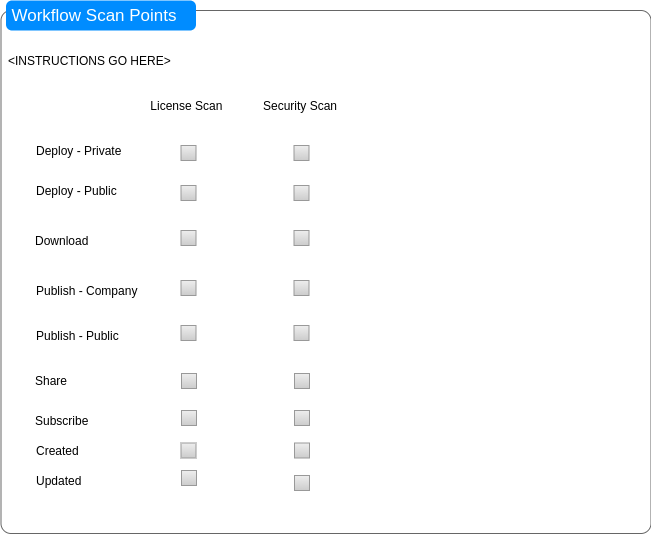
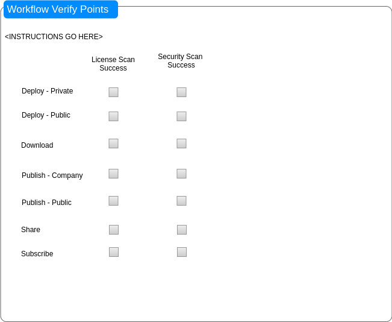

.. ===============LICENSE_START=======================================================
.. Acumos CC-BY-4.0
.. ===================================================================================
.. Copyright (C) 2017-2018 AT&T Intellectual Property & Tech Mahindra. All rights reserved.
.. ===================================================================================
.. This Acumos documentation file is distributed by AT&T and Tech Mahindra
.. under the Creative Commons Attribution 4.0 International License (the "License");
.. you may not use this file except in compliance with the License.
.. You may obtain a copy of the License at
..
.. http://creativecommons.org/licenses/by/4.0
..
.. This file is distributed on an "AS IS" BASIS,
.. WITHOUT WARRANTIES OR CONDITIONS OF ANY KIND, either express or implied.
.. See the License for the specific language governing permissions and
.. limitations under the License.
.. ===============LICENSE_END=========================================================

=====================
Business Requirements
=====================

Tools
=====
* a default set of open source license/vulnerability scan tools shall be identified and integrated, if possible
* a default set of commercial license/vulnerability scan tools shall be identified and integrated, if possible
* a portal admin shall be able to specify a supported scanning tool in a "plug and play" manner; for example, if the platform supports NexusIQ and Black Duck, the portal admin shall be able to choose which tool to use

Scanning
========

* scanning shall be made available for license/vulnerability issues in all models and related artifacts

    * scans may be invoked as early or as late as desired in the lifecycle of a model to accommodate local Acumos platform processes or policies
    * since a record of earlier scans will be retained as an artifact related to the solution, the S-V service shall only execute scans as needed for any new/updated artifacts/metadata

Scanning and Verification Workflow Integration
==============================================

* the Portal shall support integration of scanning at various points in Acumos platform workflows

    * upon completion of model onboarding ('create')
    * upon completion of metadata creation/update, e.g. documents, test data,
      source code archives
    * upon completion of artifact generation ** WHAT DOES THIS MEAN? THE DOCKER CONTAINER? AND WHAT WORKFLOW POINT DOES IT MAP TO - CREATE, UPDATE? how would this be triggered?**
    * upon request to deploy a model to a private or public cloud
    * upon request to download model artifacts or metadata
    * upon request to share a model with another user
    * upon request to publish a model to a company or public marketplace
    * upon request to subscribe to a model published in a federated platform

* the Portal shall support integration of scan results checking at various points in Acumos
  platform workflows; in other words, this check shall determine whether an action may proceed

    * deploy a model to private cloud
    * deploy a model to public cloud
    * download a model
    * share a model
    * publish to company marketplace
    * publish to public marketplace
    * subscribe to a model from a federated platform

Scanning and Status Verification Configuration Options
======================================================
The combination of admin options shall enable the platform to support customization and optimization of S-V processes for an Acumos instance. Since scans may include offline processes that take time to complete, the admin may allow some workflows to proceed while others are blocked. For example, if licensing has not been verified/approved, the admin may allow deployment to a private cloud but not deployment to a public cloud.

The Portal shall display and update a default set of success criteria for license/vulnerability scans that can be easily customized by Acumos platform operators. The Portal's ``Site Admin/Site Configuration`` page shall display and update site configuration options for security scanning, license scanning, security status verification, license status verification, and workflow-proceed criteria. These values shall be stored in a "security-verification" site config object in the Common Data Service. Please see :ref:`site-config-structure` for underlying data elements.

Workflow Scan Points
--------------------

Note: the mockup is only a suggestion

A Portal Admin shall be able to choose to start a scan at various workflow points by checking the appropriate boxes.

This section shall include an "Instructions" label with the following text: ``Select the checkbox to enable a License Scan and/or Security Scan at the relevant workflow point.``

Workflow Verify Points
----------------------

Note: the mockup is only a suggestion

A Portal Admin shall be able to choose to verify that a scan has completed with a status of ``Pass`` at various workflow poins by checking the appropriate boxes. This means that a passing scan shall be required before performing the workflow's action.  For example, if ``Security Scan Success`` is selected for ``Deploy - Private Cloud,`` the platform shall check for a passing security scan status before the model can be deployed. If both ``License Scan Success`` and ``Security Scan Success`` are selected, both must have a passing status before a model may be deployed privately.

This section shall include an "Instructions" label with the following text:
``Determines whether to check for a scan status of Pass prior to performing this workflow point's action; for example, if 'Security Scan Success' is selected for 'Deploy - Private Cloud,' the platform shall check for a passing security scan status before the model can be deployed.``

