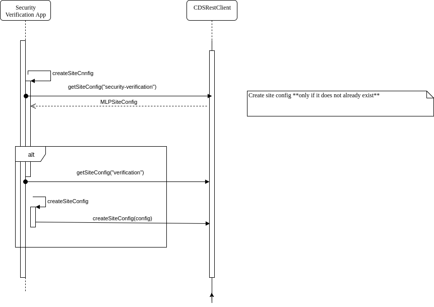
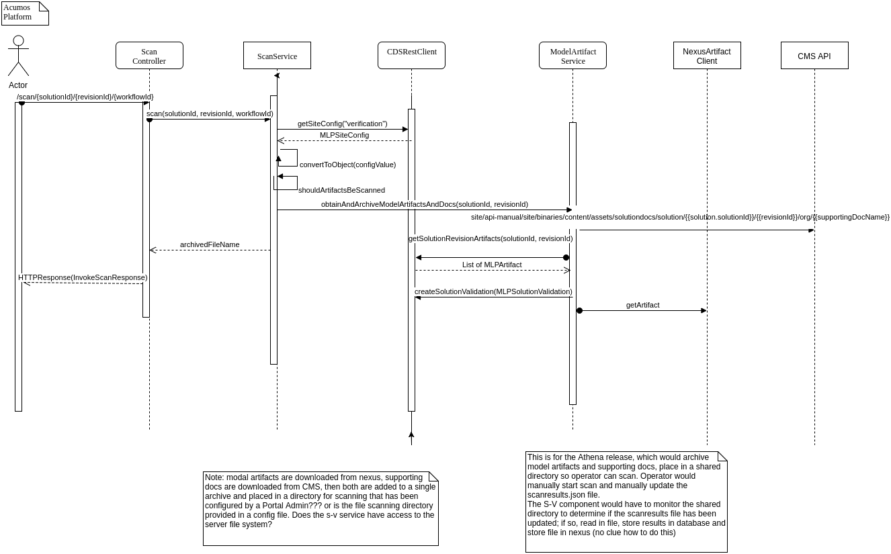

.. ===============LICENSE_START=======================================================
.. Acumos CC-BY-4.0
.. ===================================================================================
.. Copyright (C) 2017-2018 AT&T Intellectual Property & Tech Mahindra. All rights reserved.
.. ===================================================================================
.. This Acumos documentation file is distributed by AT&T and Tech Mahindra
.. under the Creative Commons Attribution 4.0 International License (the "License");
.. you may not use this file except in compliance with the License.
.. You may obtain a copy of the License at
..
.. http://creativecommons.org/licenses/by/4.0
..
.. This file is distributed on an "AS IS" BASIS,
.. WITHOUT WARRANTIES OR CONDITIONS OF ANY KIND, either express or implied.
.. See the License for the specific language governing permissions and
.. limitations under the License.
.. ===============LICENSE_END=========================================================

===============
Detailed Design
===============

Acumos Platform Component Dependencies
======================================
The S-V component shall incorporate the following component libraries, which are defined in the Maven pom file:

.. code:: xml

    <dependency>
		<groupId>org.acumos.common-dataservice</groupId>
		<artifactId>cmn-data-svc-client</artifactId>
		<version>1.16.0</version>
	</dependency>
	<dependency>
		<groupId>org.acumos.acumos-nexus-client</groupId>
		<artifactId>acumos-nexus-client</artifactId>
		<version>2.2.0</version>
	</dependency>

Component versions listed above may change.

The following Acumos components/properties shall be defined in the docker-compose.yml (and/or application.properties):

* common-data-service: cmnDataSvcEndPoinURL, cmnDataSvcUser, cmnDataSvcPwd
* nexus-client: nexusEndPointUrl, nexusUserName, nexusPassword, nexusGroupId

Common Data Service (CDS)
=========================

The Common Data Service (CDS) component provides a jar-file libary with functionality to create/add/update site config data.
See the Common Data Service `docs <https://docs.acumos.org/en/latest/submodules/common-dataservice/docs/index.html>`_ and the ICommonDataServiceRestClient `javadoc <https://javadocs.acumos.org/org.acumos.common-dataservice/master/org/acumos/cds/client/ICommonDataServiceRestClient.html>`_.

Relevant CDS client objects:

* org.acumos.cds.client

    * CommonDataServiceRestClientImpl

* org.acumos.cds.domain

    * MLPSiteConfig
    * MLPArtifact
    * MLPArtifactType
    * MLPCodeNamePair
    * MLPSolutionRevision
    * MLPSolutionValidation (refactored to MLPSolutionVerification; this is used by the Portal back end to determine if action can be taken on a model based on verification status)

Nexus Client
============
* org.acumos.nexus.client

    * NexusArtifactClient
    * RepositoryLocation

Acumos CMS
==========

Download Supporting Document by Name
------------------------------------
http://cognita-dev1-vm01-core.eastus.cloudapp.azure.com/site/api-manual/site/binaries/content/assets/solutiondocs/solution/{{solution.solutionId}}/{{revisionId}}/org/{{supportingDocName}}

http://cognita-dev1-vm01-core.eastus.cloudapp.azure.com/site/binaries/content/assets/solutiondocs/solution/f72be77e-3a86-4fc0-a576-69e010619b66/bc570778-790d-4725-974e-cc5bdb58e5cc/public/Test.txt

Get Name of  Solution Image
---------------------------
http://cognita-dev1-vm01-core.eastus.cloudapp.azure.com/site/api-manual/Solution/solutionImages/b696eab7-b9fc-4765-a800-f34788c42a8c

Download Solution Image
-----------------------
http://cognita-dev1-vm01-core.eastus.cloudapp.azure.com/site/binaries/content/gallery/acumoscms/solution/b696eab7-b9fc-4765-a800-f34788c42a8c/3rdNov.jpg

Class Diagrams
==============

.. csv-table::
    :header: "Package", "Diagram"
    :widths: 25, 75
    :align: left

    org.acumos.securityverification, .. image:: ../images/class-diagrams/securityverification.png
    org.acumos.securityverification.config, .. image:: ../images/class-diagrams/config.png
    org.acumos.securityverification.controller - REST controllers, .. image:: ../images/class-diagrams/controller.png
    org.acumos.securityverification.model, .. image:: ../images/class-diagrams/model.png
    org.acumos.securityverification.scantool - would contain third-party scanning tool wrappers, .. image:: ../images/class-diagrams/scantool.png
    org.acumos.securityverification.service, .. image:: ../images/class-diagrams/service.png
    org.acumos.securityverification.utils, .. image:: ../images/class-diagrams/utils.png

Sequence Diagrams
=================

Security-Verification Service Starts
------------------------------------

Actor Invokes Scan
------------------

