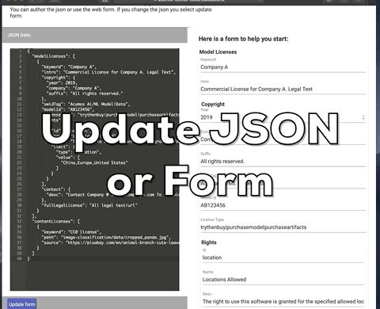
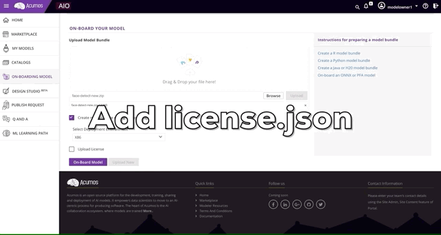
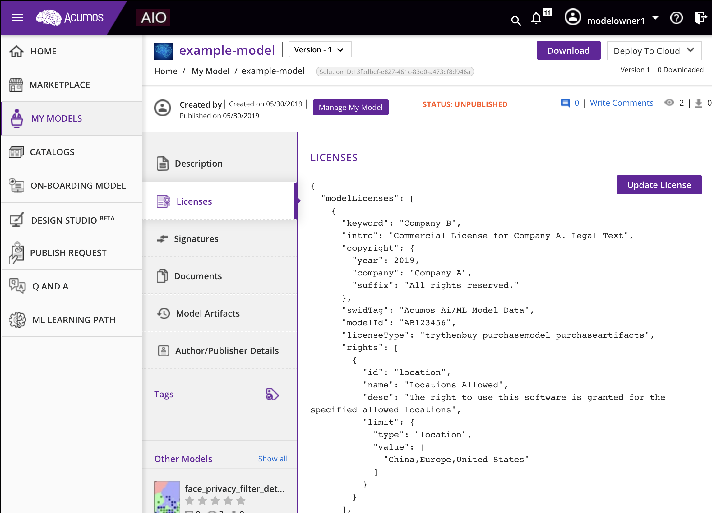

.. ===============LICENSE_START================================================
.. Acumos CC-BY-4.0
.. ============================================================================
.. Copyright (C) 2019 Nordix Foundation
.. ============================================================================
.. This Acumos documentation file is distributed by Nordix Foundation.
.. under the Creative Commons Attribution 4.0 International License
.. (the "License");
.. you may not use this file except in compliance with the License.
.. You may obtain a copy of the License at
..
..      http://creativecommons.org/licenses/by/4.0
..
.. This file is distributed on an "AS IS" BASIS,
.. WITHOUT WARRANTIES OR CONDITIONS OF ANY KIND, either express or implied.
.. See the License for the specific language governing permissions and
.. limitations under the License.
.. ===============LICENSE_END==================================================
..

============
License Json
============

Authoring a License.json
------------------------

License.json must be a valid JSON file.

You can use this web form to help you author a license.json

https://acumos-license-editor.stackblitz.io

This is also an example license.json that can be used:

.. code-block:: json

  {
    "modelLicenses": [
      {
        "keyword": "Company A",
        "intro": "Commercial License for Company A. Legal Text",
        "copyright": {
          "year": 2019,
          "company": "Company A",
          "suffix": "All rights reserved."
        },
        "swidTag": "Acumos Ai/ML Model|Data",
        "modelId": "AB123456",
        "licenseType": "trythenbuy|purchasemodel|purchaseartifacts",
        "rights": [
          {
            "id": "location",
            "name": "Locations Allowed",
            "desc": "The right to use this software is granted for the specified allowed locations",
            "limit": {
              "type": "location",
              "value": [
                "China,Europe,United States"
              ]
            }
          }
        ],
        "contact": {
          "desc": "Contact Company @ sales@companya.com To accquire the right to use this software"
        },
        "fullLegalLicense": "All legal text|url"
      }
    ],
    "contentLicenses": [
      {
        "keyword": "CC0 license",
        "path": "image-classification/data/cropped_panda.jpg",
        "source": "https://pixabay.com/en/animal-branch-cute-leaves-outdoors-1852789/"
      }
    ]
  }

Schema for License.json (wip)
-----------------------------

This is a schema that we have in progress. In Clio release
the schema will change.

.. literalinclude:: ../src/main/resources/license.schema.json
   :language: json

Attaching a License.json with a model
-------------------------------------

- **During onboarding** you can onboard a model with a license.json file.

- **After onboarding** or after creating a composite model you can
  add a license.json.

.. image:: images/attach-before-publishing.gif

Viewing the License Json in portal
----------------------------------

