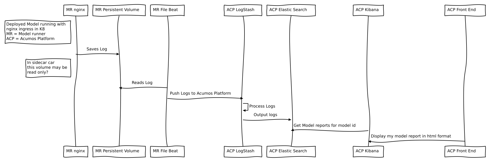

.. ===============LICENSE_START================================================
.. Acumos CC-BY-4.0
.. ============================================================================
.. Copyright (C) 2019 Nordix Foundation
.. ============================================================================
.. This Acumos documentation file is distributed by Nordix Foundation.
.. under the Creative Commons Attribution 4.0 International License
.. (the "License");
.. you may not use this file except in compliance with the License.
.. You may obtain a copy of the License at
..
..      http://creativecommons.org/licenses/by/4.0
..
.. This file is distributed on an "AS IS" BASIS,
.. WITHOUT WARRANTIES OR CONDITIONS OF ANY KIND, either express or implied.
.. See the License for the specific language governing permissions and
.. limitations under the License.
.. ===============LICENSE_END==================================================

Model Usage Tracking
====================

Acumos AI is a platform and open source framework that makes it easy to build,
share, and deploy AI apps (models).

With Boreas release, Acumos platform comes with AI Model usage tracking feature
(for models that are deployed in a Kubernetes cluster).

Model usage tracking feature leverages on Elastic Stack which is part of the
Acumos platform for collecting, processing, searching/indexing usage data
and visualizing reports.

As the diagram illustrates, model access/calls are recorded by nginx sidecar to
a persistent volume (log file), which the Filebeat daemon instance reads and
pushes to Acumos platform Elastic Stack.

In this article, we are referring to `Soup-to-Nuts Example <https://wiki.acumos.org/display/AC/Soup-to-Nuts+Example%3A+Onboarding+Models%2C+Creating+and+Deploying+a+Composite+Solution+in+Acumos>`_
that sets up face-privacy-filter - single and composite model
solutions. You can onboard those models (or any other models) as illustrated
in the Soup-to-Nuts example doc.

Following image illustrates AI model method calls and respective
usage count.

  .. image:: images/comp-model-usage-1.gif

.. toctree::
    :maxdepth: 2
    :titlesonly:
    :glob:

    model-usage-tracking-simple.rst
    model-usage-tracking-comp.rst

..
