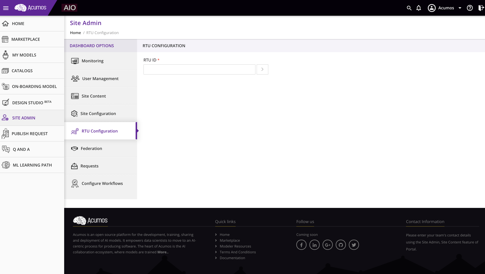
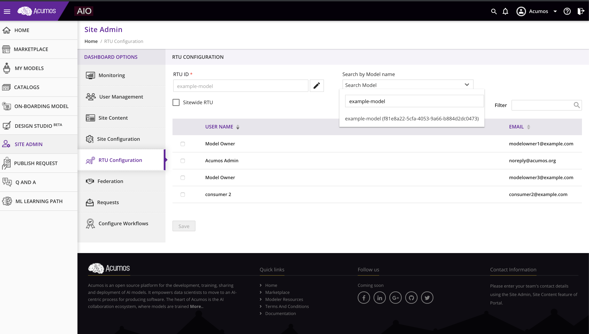
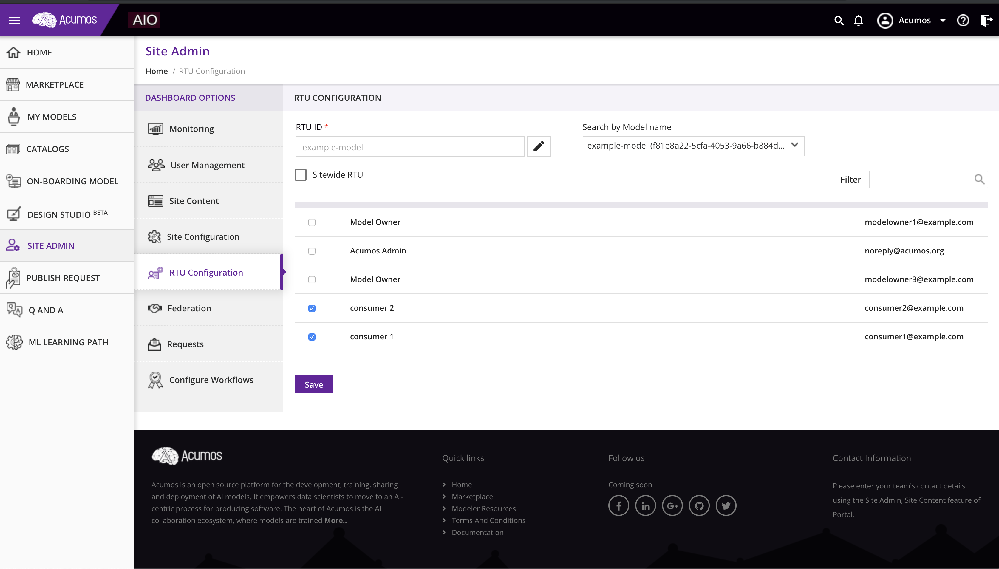
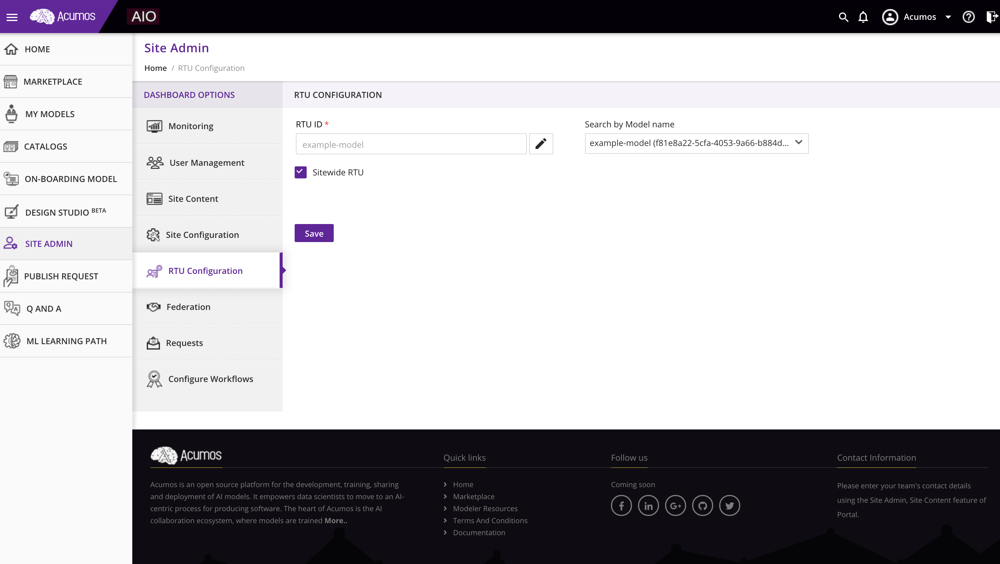
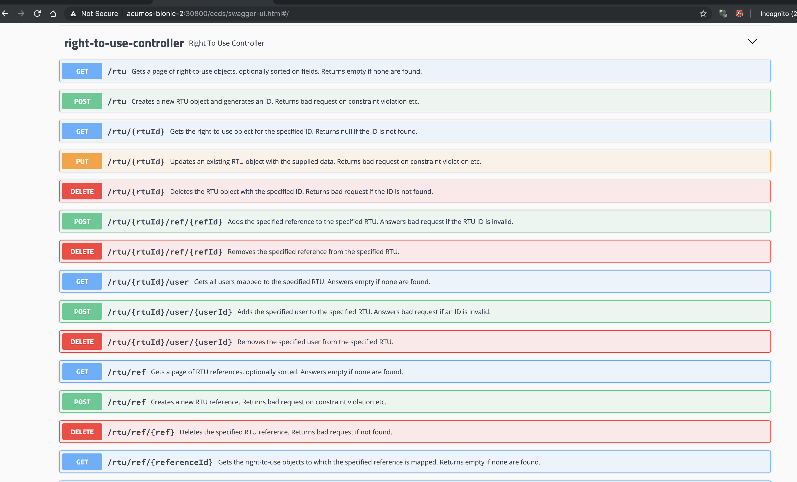

.. ===============LICENSE_START================================================
.. Acumos CC-BY-4.0
.. ============================================================================
.. Copyright (C) 2019 Nordix Foundation
.. ============================================================================
.. This Acumos documentation file is distributed by Nordix Foundation.
.. under the Creative Commons Attribution 4.0 International License
.. (the "License");
.. you may not use this file except in compliance with the License.
.. You may obtain a copy of the License at
..
..      http://creativecommons.org/licenses/by/4.0
..
.. This file is distributed on an "AS IS" BASIS,
.. WITHOUT WARRANTIES OR CONDITIONS OF ANY KIND, either express or implied.
.. See the License for the specific language governing permissions and
.. limitations under the License.
.. ===============LICENSE_END==================================================

Right-To-Use (RTU) Configuration
================================

Note - This feature applies to models with commercial / not open source SPDX licenses.

As an admin role in the platform you will have access to the RTU 
configuration view.To enable this feature you must be using portal
back end (portal-be) with Security verification enabled below
is an example of the configuration you must have to use to enable this feature:

.. code-block:: json

  SPRING_APPLICATION_JSON: '{
          "portal": {
            "feature": {
            ...
              "sv": {
                "enabled": "true",
                "api": "http://sv-scanning-service:9082/scan"
              },
              ...
            },
            ...
  }'

In this view you can add a new Rtu Id for a solution. You cannot have more than one 
rtu id per solution. Each RTU can be either a Site Wide RTU (any user doesn't matter when
they joined. 

Step 1 - Go to RTU Configuration View

Step 2 - Select a name for the RTU - in this example the RTU id is the same as the name 
of the model: example-model.

Step 3 - Search for the model you want to associated with the RTU.

User-specific RTU
-----------------

For a User specific RTU you can select any user you find.
You do not need to select the model owner. The RTU check will not
be made for the owner of the model. For federated models the owner is 
the admin account that subscribed to the models.

Select a User or set of Users - Note - you may need to scroll the grid to see more users.

Once you save the user will be able to remove users when you come back. 
Acumos platform doesn't notify users that there right has been removed. 
Please make sure you inform the user outside of Acumos platform.

Site-wide RTU
-------------

For a site wide RTU you will give access to any user. Just select the site wide checkbox.

Swagger
-------

Admin users can view all RTU using the swagger interface for CDS.
The admin user can search, update, remove RTU using the right to use CDS controller.

