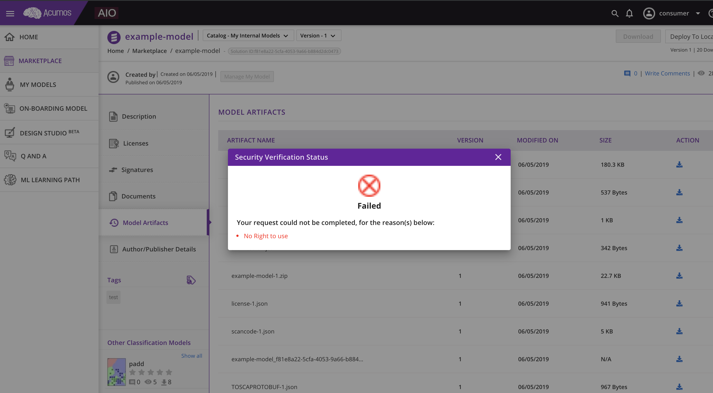

.. ===============LICENSE_START================================================
.. Acumos CC-BY-4.0
.. ============================================================================
.. Copyright (C) 2019 Nordix Foundation
.. ============================================================================
.. This Acumos documentation file is distributed by Nordix Foundation.
.. under the Creative Commons Attribution 4.0 International License
.. (the "License");
.. you may not use this file except in compliance with the License.
.. You may obtain a copy of the License at
..
..      http://creativecommons.org/licenses/by/4.0
..
.. This file is distributed on an "AS IS" BASIS,
.. WITHOUT WARRANTIES OR CONDITIONS OF ANY KIND, either express or implied.
.. See the License for the specific language governing permissions and
.. limitations under the License.
.. ===============LICENSE_END==================================================

RTU Download/Deploy Model Artifacts
===================================

If you are using a model with a commercial model such as Company-B-Proprietary
(as configured with security verification license scanner)
and you are not the owner of the model  you will be required to have a right to use.

When you request to download an artifact you will initially encounter this
message in the portal:

You must reach out to the admin of Acumos portal to be assigned a right to use.

If you are the admin or need to provide documentation to your admin
please see `Rtu Creation <rtu-creation.html>`_.
=======
..
