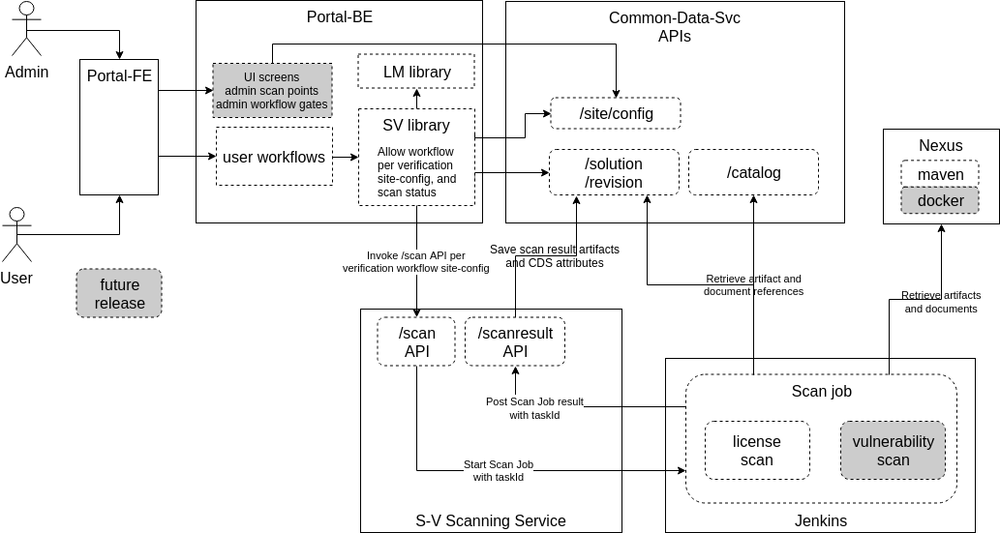

.. ===============LICENSE_START=======================================================
.. Acumos CC-BY-4.0
.. ===================================================================================
.. Copyright (C) 2017-2018 AT&T Intellectual Property & Tech Mahindra. All rights reserved.
.. ===================================================================================
.. This Acumos documentation file is distributed by AT&T and Tech Mahindra
.. under the Creative Commons Attribution 4.0 International License (the "License");
.. you may not use this file except in compliance with the License.
.. You may obtain a copy of the License at
..
.. http://creativecommons.org/licenses/by/4.0
..
.. This file is distributed on an "AS IS" BASIS,
.. See the License for the specific language governing permissions and
.. limitations under the License.
.. ===============LICENSE_END=========================================================

=================================================
Acumos Security-Verification Design Specification
=================================================

This document describes the design for the Acumos platform Security-Verification
component and related capabilities. This component will be delivered in the
Boreas release.

-----
Scope
-----

The Security-Verification component (referred to here as SV) addresses the
following goals of the Acumos project, as outlined by the
`Acumos TSC Security Committee <https://wiki.acumos.org/display/SEC>`_:

* models and related metadata that are contributed to an Acumos platform and
  distributed through a federated ecosystem of Acumos platforms must be
  verified to the extent possible, as

  * contributed under clear and compatible licenses
  * free from security vulnerabilities

This in turn is based upon the
`bylaws of the Acumos project <https://www.acumos.org/wp-content/uploads/sites/61/2018/03/charter_acumos_mar2018.pdf>`_
which include the following responsibilities as described in section 2.i.vii

.. code-block:: text

  vii. establishing: (1) a vetting process for maintaining security and integrity of
  new and/or changed code and documentation, including vetting for
  malicious code and spyware and (2) a security issue reporting policy and
  resolution procedure;
..

The above bylaws apply to both the Acumos platform code and the federated
ecosystem of Acumos platform instances and models (referred to also as
"solutions" here) distributed through them. This document addresses the
Acumos project support for the latter goal.

Note that for license scanning, the SV service is focused on the presence and
appropriateness of model license, as they related to the policies of the
Acumos platform operator. The SV service is not specifically designed to verify
other potential "licensing" concerns, such as the RTU (right to use) of the user
for a model, as would be governed by a license contract between a model supplier
and model user. Those concerns go beyond the verification of a license as
provided by the model supplier, as a simple expression of the terms under which
that model is made available to users. The two purposes may share common
concepts and controls as provided by the Acumos platform, but this design only
addresses the former concern.

The SV service will be scoped to address the essential concerns that we have
the resources and technology to address in an open source context. Beyond that,
Acumos community policies and offline practices will need to address the rest.
Following is a short list of some potential concerns, not all of which may be
considered of essential focus for machine-learning models which are collaborated
upon and distributed through a federated ecosystem such as Acumos. Acumos
community discussions will be used to determine which concerns we should put
in scope for implementation.

* Vulnerabilities in solutions and metadata distributed with those solutions
  including real/demo applications of the solutions, test data, documentation,
  etc. Such vulnerabilities can range across the following example set of risk
  categories, which can be viewed as "soft risks" (things which can be used by
  bad actors to increase risks) and "hard risks" (things which represent overt
  malicious risks, when embedded in the solutions and metadata):

  * soft risks, such as bad coding/documentation practices, e.g.

    * incluson of sensitive personal information (SPI) about real individuals,
      assumed to be a risk mostly in test data
    * inclusion of real system addresses or API URLs, along with credentials
      providing access to those systems/APIs
    * unprotected, potentially sensitive APIs
    * code quality issues that can result in unreliable behavior or create
      attack opportunities

  * hard risks, such as

    * malicious or compromised design in software components, either overt or
      inadvertent (e.g. by compromised/malicious code reuse, or importation),
      enabling e.g.

      * host system hacking
      * intrusion behavior, e.g. host/port probing
      * network behavior outside expected norms (e.g. for models, network
        behavior other than serving protobuf interfaces)
      * DDOS/botnets
      * creation of backdoors

    * known threats, e.g. viruses, trojans, etc as embedded in binaries,
      documents, rich media, etc

* Unclear, incomplete, incorrect, or incompatible licenses and/or copyright
  attribution

  * soft risks

    * lack of trust, inhibiting adoption of the solutions
    * perpetuating bad licensing/attribution practices

  * hard risks

    * unclear liabilities, e.g. due to

      * inclusion of undisclosed, GPL-family licensed code or other licenses
        with specific use-limitations or reservations
      * failure to properly license or attribute included solution software, or
        metadata (e.g. source code, documentation, test data, rich media, etc)

......................................
Implementation Approach Considerations
......................................

Given the importance of managing risks such as above, the key question is how
that capability needs to, or can be, implemented. This design assumes that the
goal of the SV component of the Acumos platform is to provide a comprehensive,
as-much-automated-as-possible, platform-integrated service that fulfills the
goals. Thus the design below attempts to lay out an approach to that. This
design however may not be achievable in a single release or in full, since:

* project resource may be insufficient
* technical solutions to some of the goals may be unavailable, e.g.

  * machine-learning technologies are fairly new, and ability
    to detect malicious design in compiled models (e.g. in pickle files) may be
    limited technically
  * when compared to signatures of well-known or new threats to host systems or
    consumer devices (e.g. PCs) as supported by open source virus/malware scan
    tools, there may be limited experience thus limited libraries of threat
    signatures for compiled ML models

Thus alternate/fallback implementation approaches are described below, so that
as much of the goals as possible can be delivered in the Boreas release, or as
soon as possible afterward. These alternate approaches are based upon the
following assessments of how the bylaws goals related to potential implementation
approaches, such as:

* a comprehensive, as-much-automated-as-possible, platform-integrated service

  * this is the stated approach, given that resources and technical
    solutions are available

* a hybrid approach of some manual processes, supplementing the automated
  platform capabilities, e.g.

  * manual admin of the platform capabilities, through configuration files that
    are provisioned on the platform hosts, and used by the components in the
    absence of portal-marketplace admin UI support for the same configuration
  * exporting solution packages (artifacts and metadata) for offline scanning,
    in the absence of integrated, automated scanning tools
  * maintaining the status of scans (e.g. unrequested, in-progress, successful,
    failed) as a key input to enabling/blocking workflows for solutions, through
    a manual but API-supported process, in the absence of automated updates of
    status based upon integrated scanning

* a fully manual, open source toolset-supported process that is ensured by
  establishment of community policies and related practices

  * in this case there may be no specific platform-integrated support for
    scanning, verification status management, policy definition or control of
    workflows per those policies, etc
  * open source toolsets and user guides however could be provided to help
    operators/admins to fulfill the requirements of their company and of the
    Acumos ecosystem
  * beyond the above, a priority would be placed on a "trust but verify"
    approach to policy adherence and modeler behaviors that support best
    practices and policies

Depending on how the Acumos community prioritizes the goals of SV, the
various approaches above, and how successful the SV team is in resourcing and
addressing technical challenges of the design below, various of these
hybrid/manual approach elements may be implemented in the Athena release.

............................
Previously Released Features
............................

This is the first release of SV.

........................
Current Release Features
........................

The features planned for delivery in the current release ("Boreas") are:

* scanning for license/vulnerability issues in all models and related data
* a default set of open source license/security scan tools, which can be
  replaced in a "plug and play" manner with tools as preferred by Acumos
  platform operators
* customization of the default scan tools, e.g. to define new licenses and scan
  tool configuration to support detecting the licenses
  for detecting them
* a default set of success criteria for license/security scans, which can
  be easily customized by Acumos platform operators
* integration of scanning at various points in Acumos platform workflows
* integration of scan result checking gates at various points in Acumos
  platform workflows
* Acumos platform admin control of the scanning and gate check points

  * option to use the default internal scan tools, or an offline process for
    scanning
  * option to invoke scanning in workflows

    * upon completion of model onboarding
    * upon completed addition/update of artifacts or "documents" (documents,
      test data, source code archives)
    * upon request to deploy a model
    * upon request to download model artifacts or documents
    * upon request to share a model with another user
    * upon request to publish a model to a marketplace

  * option to define workflow gates that must be passed, in order to allow the
    workflow to be executed, including

    * enable checking prior to workflows

      * deploy a model
      * download a model
      * share a model
      * publish a model

    * what must have been checked, and what are the acceptable results

      * license scan successful: yes, no
      * security scan successful: yes, no

  * ability of the model owner to execute any workflow except for publishing
    without needing to pass the workflow gate-check; this is essential to
    prevent the SV feature from unecessarily burdening the model developer
    experience, and is critial to ensure that the model developer can correct
    issues that may resulting in scan failures, e.g. upload new documents or
    licenses to correct earlier-detected issues
  * support for both open-source and proprietary licensed models
  * incorporation of RTU ("right to use") checks for proprietary models as part
    of workflow gates; except for model owners, users who do not have a provisioned
    RTU for a proprietary model will be blocked from the following workflows

    * download
    * deploy

The combination of the two gate-check options enables the platform to support
customization and optimization of SV processes for an Acumos instance.
For example:

* scans can be invoked as early or as late as desired, in the lifecycle of a
  model, to accommodate local Acumos platform processes or policies
* since "scans" may include offline processes that take time to complete,
  the admin may allow some workflows to be proceed, while others are blocked.
  For example, if licensing has not been verified/approved, the admin may allow
  deployment to a private cloud to publishing to a company marketplace, but not
  deployment to a public cloud or publishing to a public marketplace.
* the Scanning Service will only execute scans as needed for any new/updated
  artifacts/metadata, since a record of earlier scans will be retained as a
  artifact related to the solution.

------------------------------------------
Recommended Tests for Feature Verification
------------------------------------------

The following test descriptions provide a guide to the expected user experience
and SV service behavior, for common use cases. These can be used as a guide for
testers to verify that user experience and system features.

..........................
Tests for Simple Solutions
..........................

++++++++++++++++++++++++++++++++++++++++++++++++++
Scan invocation per verification.licenseScan flags
++++++++++++++++++++++++++++++++++++++++++++++++++

As applicable for the flags below from the "verification" siteConfig key
(default values shown), verify that a scan is invoked (either from the
sv-scanning-service logs, or by watching the revision.verifiedLicense attribute
become "IP").

.. code-block:: text

   "licenseScan": {
     "created": "true",
     "updated": "true",
     "deploy": "true",
     "download": "true",
     "share": "true",
     "publishCompany": "true",
     "publishPublic": "true"
   },
..

These workflows should trigger the scan as applicable:

* created: web-onboarding
* updated: adding/modifying solution description or documents through the
  "Manage My Model" / "Publish to Marketplace" screen
* deploy: deploy request for any target environment
* download: request to download any artifact or document
* share: request to share a model
* publish: request to publish a model

++++++++++++++++++++++++++++++++++++++++++++++++++++
Workflow gating per verification.licenseVerify flags
++++++++++++++++++++++++++++++++++++++++++++++++++++

As applicable for the flags below from the "verification" siteConfig key (default
values shown), verify that workflows are either (1) allowed, if
revision.verifiedLicense=SU; or (2) blocked (with reason displayed to the user
and added to the notification tool for later review) if
revision.verifiedLicense=FA or revision.verifiedLicense=IP.

.. code-block:: text

   "licenseVerify": {
     "deploy": "true",
     "download": "true",
     "share": "false",
     "publishCompany": "true",
     "publishPublic": "true"
   },
..

These workflows should be allowed or blocked as applicable:

* deploy: deploy request for any target environment
* download: request to download any artifact or document
* share: request to share a model
* publish: request to publish a model

+++++++++++++++++++++
License Scan Failures
+++++++++++++++++++++

Any of these scenarios should result in revision.verifiedLicense=FA, with the
reason in parentheses:

* no license.json artifact ("no license artifact found, or license is
  unrecognized")
* license.json does not have a recognized license ("no license artifact found,
  or license is unrecognized")
* license.json does not have an approved license ("root license($root_license)
  is not allowed")
* a license from any other scanned file is not allowed ($file license($name)
  is not allowed)
* a license from any scanned file is incompatible with the root license
  ("$path license($name) is incompatible with root license $root_name")

++++++++++++++++++++
License Scan Success
++++++++++++++++++++

In the absence of any of the conditions in `License Scan Failures`_, the
license scan completes with revision.verifiedLicense=SU.

++++++++++++++++++++++++++++++++++++++++++++++++++++++
Storage of scanresult.json and scancode.json artifacts
++++++++++++++++++++++++++++++++++++++++++++++++++++++

At the end of each scan the resulting scanresult.json and scancode.json artifacts
are created or updated as applicable, and avaiable in the Portal UI list of
artifacts as "scanresult-<version>.json and scancode-<version>.json, where
<version> is the version of the solution scanned.

.............................
Tests for Composite Solutions
.............................

+++++++++++++++++++++++++++++++++++++++++++++++++++++
Scan invocation for all composite solution components
+++++++++++++++++++++++++++++++++++++++++++++++++++++

When a scan invocation is required per the verification.licenseScan flags, all
sub-component solutions of the composite solution are scanned, and their
revision.verifiedLicense attributes are updated.

+++++++++++++++++++++++++++++++++++++++++++++++++++++++++++++++++++++++++++++++++++++++++++
Workflow determination considers verification.licenseVerify for all sub-component solutions
+++++++++++++++++++++++++++++++++++++++++++++++++++++++++++++++++++++++++++++++++++++++++++

When workflow gating is required per the verification.licenseVerify flags, the
revision.verifiedLicense attribute for every sub-component solution must be "SU"
for the workflow to be allowed.

------------
Architecture
------------

The following diagram illustrates the integration of SV into an Acumos platform.
The items in gray are planned for future releases.

.....................
Functional Components
.....................

The SV service will include two components, one of which is a component microservice:

* Security Verification Library ("SV Library"): implemented as a Java library
  that Acumos components include in their build processes, this library provides
  an interface that abstracts the status checking and scan invocation processes,
  and determines for the current workflow:

    * whether a scan process needs to be invoked, and invoking it if so
    * whether the workflow should be blocked based upon the SV requirements
      established by the platform admin, given the current status of SV for
      the model, and based upon the need for and availability of a related RTU

  * uses CDS site-config data to determine when to invoke scanning
  * uses CDS site-config data, solution, and revision data to determine if
    workflows are allowed
  * runs as a always-on service under docker or kubernetes

* Scanning Service: this is the backend to the SV service, which

  * provides a scanning API to execute scan operations as needed using scanning
    tools for license and vulnerabilities
  * allows Acumos operators to use a default set of scan tools, or to integrate
    other tools via a plugin-style interface
  * runs as an always-on service under docker or kubernetes

..........
Interfaces
..........

The SV service provides the following library functions and APIs.

++++++++++++++++++++++++++++++++++++
Security Verification Client Library
++++++++++++++++++++++++++++++++++++

This Java library is included in the build specification (pom.xml) of calling
components in order to assess the SV status of components as it affects
Acumos workflows, and to scan invocation as needed.

The SV library function will take the following parameters:

* solutionId: ID of a solution present in the CDS
* revisionId: ID of a version for a solution present in the CDS
* workflowId: one of

  * created: model has been onboarded
  * updated: model artifacts/metadata have been updated
  * deploy: request to deploy received
  * download: request to download received
  * share: request to share received
  * publishCompany: request to publish to company marketplace received
  * publishPublic: request to publish to public marketplace received

* loggedInUserId: ID of the user who is requesting the workflow, used to
  compare with the owner of the solution

In response, the SV library will provide the following result parameters:

* workflow allowed: boolean (true|false)

  * true: the SV service is either not configured to gate the current
    workflow, or the gate conditions have been fulfilled
  * false: the gate conditions for the workflow have not been fulfilled, as
    defined by the Acumos system admin and/or the RTU check

* reason: text description of the reason for workflow being blocked, for
  presentation to the user; NOTE: configuration of these messages is a planned
  feature, but not supported in the Boreas release

  * $path license($license) is incompatible with root license $root_license

    * a file ($path identifies the file in the structure of scanned files) has
      a detected license which is incompatible with the detected root license
      (the license in the artifact 'license.json')

  * $file license($name) is not allowed

    * a license detected in a file is not in the allowedLicense set

  * no license artifact found, or license is unrecognized

    * either no license.json artifact was found, or the license keyword in the
      artifact.json was not recognized

  * root license($root_license) is not allowed

    * the license keyword in license.json was recognized but is not in the
      allowedLicense set

  * Internal error: $root_license not found in compatible license list

    * only applies when the site configuration is incomplete (a license was
      added to the allowedLicense set but not the compatibleLicenses set)

++++++++++++++++++++++++++++++++++++++
Security Verification Scanning Service
++++++++++++++++++++++++++++++++++++++

This API initiates a SV scan process as needed, based upon the current status
of the model and any earlier scans in-progress or completed.

The base URL for this API is: http://<scanning-service-host>:<port>, where
'scanning-service-host' is the routable address of the scanning service in the
Acumos platform deployment, and port is the assigned port where the service is
listening for API requests.

* URL resource: /scan/solutionId/{solutionId}/revisionId/{revisionId}/workflowId/{workflowId}

  * {solutionId}: ID of a solution present in the CDS
  * {revisionId}: ID of a version for a solution present in the CDS
  * {workflowId}: name of a workflow, one of "created", "updated", "deploy",
    "download", "share", "publishCompany", "publishPublic"

* Supported HTTP operations

  * POST

    * Response

      * 200 OK

        * meaning: request accepted

      * 400 BAD REQUEST

        * meaning: solution/revision not found, or other error

----------------
Component Design
----------------

..............................
Common Data Service Data Model
..............................

The following data model elements are defined/used by the SV service:

* solution

  * revision

    * artifact: the Scanning Service will retrieve all solution artifacts in the
      process of scanning or verifying status of earlier scans, and create one
      new type SR artifact named scanresult.json, as a record of scan results

    * a new artifact type is needed as below, with a related artifact type

      * Scan Result, attribue type SR, which will be used to identify scan
        related artifacts

        * "scanresult.json": the summary of a scan; with each new scan of a
          revision, this file will be updated in Nexus
        * "scancode.json": the detailed result from the Scancode Toolkit utility

    * new revision attributes are needed as below, and a new API is needed to
      retrieve and set values for these attributes

      * verifiedLicense: success | failure | in-progress | unrequested (default)
      * verifiedVulnerability: success | failure | in-progress | unrequested (default)

        * this is reserved for future use

.............................
Security Verification Library
.............................

The Security Verification Library ("SV Library") will be integrated as a
callable library function by Java-based components, through reference in their
pom.xml files. The SV library has the following dependencies, which must be
specified in the template used to create the calling component:

* environment

  * common-data-svc API endpoint and credentials
  * scanning-service API endpoint

Acumos components will call the SV library function when they need to check
if a workflow should proceed, based upon the admin requirements for verification
related to that workflow, and the status of verification for a solution/revision.
In addition to checking if the requested workflow should proceed the SV library
will invoke scan operations as needed.

The SV client follows this procedure when invoked:

* initialize "workflow allowed" to "true" and reason to ""
* retrieves the solution and revision details from the CDS, and if either
  are not found, return “workflow allowed”=”false” and
  reason=”solution/revision not found” as appropriate
* if the modelTypeCode is PR (predictor) and the toolkitTypeCode is CP
  (composite solution)

  * retrieves the CD (CDUMP) artifact for the revision
  * deserializes the CDUMP artifact and for each member of the nodes array
    included in the CDUMP object

    * using the member nodeSolutionId, retrieves the list of revisions for the
      solution
    * for the revision that matches the nodeVersion for the member of the nodes
      array, executes the "revision processing" using its revisionId

    * the "revision processing" below is executed for the solution and all of its
      component solutions, with the "workflow allowed" result result returned being
      the logical AND of the result for all, i.e. if the workflow gate is blocked
      for the composite solution or any of its components, the summary result is
      that the workflow is blocked.

* the SV library uses this procedure for revision processing

  * determines whether the workflow should be blocked based upon RTU

    * if a scanresult.json artifact exists and indicates that the solution has a
      proprietary license

      * if the user is not the solution owner, and the requested workflow is
        "download" or "deploy"

        * if the user does not have an RTU for the solution, block the workflow

  * invokes a scan if the licenseScan flag for the workflow is "true"
  * if the site config verifyLicense flag for the workflow is "true", determines
    whether the workflow should be blocked based upon status of license scanning

    * if the verifiedLicense attribute of the solution is null, "IP" (in-progress),
      or "FA" (failed), block the workflow, and provide the reason

      * null: "license scan not yet started"
      * IP: "license scan in-progress"
      * FA: the reason attribute of the scanresult.json artifact

* Return the values for "workflow allowed" and "reason"

................
Scanning Service
................

The Scanning Service will be deployed as an always-running platform
service under docker or kubernetes. It has the following dependencies, which
must be specified in the service template used to create the service:

* environment

  * common-data-svc API endpoint and credentials
  * nexus-service API endpoint and credentials
  * site-config verification key default

* ports: Acumos platform-internal port used for serving APIs (NOTE: this must
  also be mapped to an externally-accessible port so that the service can
  provide the /scanresult API to external scanning services)
* conf volume: a host-mapped folder (for docker) or configmap (for kubernetes)
  with the following folders/files as needed to customize the Scanning Service
  for a particular operator

  * licenses: metadata files for additional licenses to be scanned for, in
    addition to the default of licenses supported by the Scancode Toolkit
  * rules: license-detection rules for the additional licenses
  * scripts: bash scripts that can be customized as needed, e.g. to

    * update the default site config for SV (the "verification" config key)
    * customize the startup of the SV service
    * customize what metadata is downloaded from the Acumos platform for
      scanning
    * customize the scan process, e.g. modify the use of Scancode, or replace
      it with a different utility
    * implement/integrate an offline process for scanning, e.g. invoke an
      external service, and process scanresult events from that service
    * fix issues that arise during use of the scanning service, without having
      to rebuild a new service container image

* logs volume: persistent store where the service will save logs

The Scanning Service will record and use the results of scans in a new artifact
type as described in `Scan Result`_, associated with the scanned revision. This
artifact is central to various design goals of the SV service, e.g.:

* maintaining a semantic, human-readable, and easily exportable record of scans
  related to a revision
* making the scan results available to those who obtain the solution though
  sharing, downloading, or federated subscription

++++++++++++++++
Site-Config Data
++++++++++++++++

The SV Service leverages a new site-config key "verification", which as
a serialized JSON object defines the related policies for the platform, as a set
of flags that control the four main features of the SV service per the needs of
the Acumos platform operator:

  * workflow gates, i.e. when evidence of successful license and vulnerability
    scans is required, for a workflow to be allowed
  * at which workflows license and security scans should be invoked
  * whether an internal or external license scanning service should be used
  * which license types are pre-approved for use with solutions
  * which license types are considered compatible with other licenses

    * this ensures that in addition to verifying the root license (in
      license.json), scans can verify that any license in files included as
      metadata (documents) associated with the revision, is compatible with the
      root license

Default values for these options are set through the component configuration data
for the Scanning Service, and can be customized by the platform operator prior
to deployment of the SV Service by updating the SV Scanning service template
or the siteconfig-verification.json file in the scripts folder of the conf
volume described above. When the SV Scanning Service starts, the verification
site-config key will be created or replaced with the current value from the
SV Scanning template, or siteconfig-verification.json in the conf volume. This
process is needed since in Boreas there is no specific Acumos Portal support for
managing the configuration through an admin UI.

The key structure is described below:

* verification

  * allowedLicense: array of attributes that can be used to recognize licenses
    that are pre-approved for use with models in the platform

    * type: SPDX | <other type identifiers, e.g. "VendorX">
    * name: a unique string that can be used to identify the license in
      LICENSE.txt files associated with models as a document, or in other files
      (e.g. source code or other documents). Examples include
      `SPDX license identifiers <https://spdx.org/licenses/>`_ and other values
      e.g. identifying a vendor-specific license.

  * compatibleLicenses: array of licenses compatible with the set of allowed
    licenses

    * name: name as present under allowedLicense
    * compatible: array of license names that are considered compatible

  * externalScan: boolean indicating whether the Scanning Service should use an
    external scan process as described in `External Scan`_. Defaults to "false".

    * Note: external scans are not explicitly supported in Boreas, although this
      site config flag may be useful to operators that choose to implemented their
      own process for external scans

  * licenseScan: license scanning requirements for workflows. See the
    definition of workflowId above for explanation of the workflow names. Each
    workflow is associated with a boolean value, which if "true" indicates
    that a license scan should be invoked at this workflow point.

    * created: true | false
    * updated: true | false
    * deploy: true | false
    * download: true | false
    * share: true | false
    * publishCompany: true | false
    * publishPublic: true | false

  * securityScan: security scanning requirements for workflows. See
    the definition of workflowId above for explanation of the workflow names.
    Each workflow is associated with a boolean value, which if "true" indicates
    that a security scan should be invoked at this workflow point.

    * created: true | false
    * updated: true | false
    * deploy: true | false
    * download: true | false
    * share: true | false
    * publishCompany: true | false
    * publishPublic: true | false

  * licenseVerify: license scanning verification requirements for workflows.
    See the definition of workflowId above for explanation of the workflow
    names. Each workflow is associated with a boolean value, which if "true"
    indicates that a successful license scan must have been completed before
    the workflow begins.

    * deploy: true | false
    * download: true | false
    * share: true | false
    * publishCompany: true | false
    * publishPublic: true | false

  * securityVerify: security scanning verification requirements
    for workflows. See the definition of workflowId above for explanation of
    the workflow names. Each workflow is associated with a boolean value,
    which if "true" indicates that a successful security scan must have
    been completed before the workflow begins.

    * deploy: true | false
    * download: true | false
    * share: true | false
    * publishCompany: true | false
    * publishPublic: true | false

An example serialized value for the site-config verification key is shown below.

.. code-block:: text

  {
    "externalScan":"false",
    "allowedLicense":[
      {
        "type":"SPDX",
        "name":"Apache-2.0"
      },
      {
        "type":"SPDX",
        "name":"CC-BY-4.0"
      },
      {
        "type":"SPDX",
        "name":"BSD-3-Clause"
      },
      {
        "type":"Vendor-A",
        "name":"Vendor-A-OSS"
      },
      {
        "type":"Company-B",
        "name":"Company-B-Proprietary"
      }
    ],
    "compatibleLicenses":[
      { "name":"Apache-2.0", "compatible":[
          { "name":"CC-BY-4.0" },
          { "name":"Apache-2.0" },
          { "name":"BSD-3-Clause" },
          { "name":"MIT-License" }
        ]
      },
      { "name":"BSD-3-Clause", "compatible":[
          { "name":"CC-BY-4.0" },
          { "name":"Apache-2.0" },
          { "name":"BSD-3-Clause" },
          { "name":"MIT-License" }
        ]
      },
      { "name":"MIT-License", "compatible":[
          { "name":"CC-BY-4.0" },
          { "name":"Apache-2.0" },
          { "name":"BSD-3-Clause" },
          { "name":"MIT-License" }
        ]
      },
      { "name":"Vendor-A-OSS", "compatible":[
          { "name":"Vendor-A-OSS" },
          { "name":"CC-BY-4.0" },
          { "name":"Apache-2.0" },
          { "name":"BSD-3-Clause" },
          { "name":"MIT-License" }
        ]
      },
      { "name":"Company-B-Proprietary", "compatible":[
          { "name":"Company-B-Proprietary" },
          { "name":"CC-BY-4.0" },
          { "name":"Apache-2.0" },
          { "name":"BSD-3-Clause" },
          { "name":"MIT-License" }
        ]
      }
    ],
    "licenseScan":{
      "created":"true",
      "updated":"true",
      "deploy":"true",
      "download":"true",
      "share":"true",
      "publishCompany":"true",
      "publishPublic":"true"
    },
    "securityScan":{
      "created":"true",
      "updated":"true",
      "deploy":"false",
      "download":"false",
      "share":"false",
      "publishCompany":"false",
      "publishPublic":"false"
    },
    "licenseVerify":{
      "deploy":"true",
      "download":"true",
      "share":"true",
      "publishCompany":"true",
      "publishPublic":"true"
    },
    "securityVerify":{
      "deploy":"true",
      "download":"true",
      "share":"false",
      "publishCompany":"true",
      "publishPublic":"true"
    }
  }
..

+++++++++++
Scan Result
+++++++++++

Revision artifacts of type SR (scanresult.json, referred to here as the
"Scan Result") will record the result of scanning for a revision. For each scan,
a new Scan Result version will be created, so that the history of scanning
is preserved. This or later releases will provide admins with the ability to
limit the number of Scan Result versions maintained for a revision.

The Scan Result will be initialized at the start of a scan, and be created in
this schema:

.. code-block:: text

  {
    "schema": "1.0",
    "verifiedLicense": "<true|false>",
    "reason": "<reason for scan failure, if any>",
    "solutionId" : "<solutionId from the API request>",
    "revisionId" : "<revisionId from the API request>",
    "scanTime" : "<epoch time value when the scan was started>",
    "root_license": {
      "type": "<type value from the allowedLicense array>",
      "name": "<name value from the allowedLicense array>"
    },
    "files": [
      {
      "path": "<folder path of the file as scanned>",
      "licenses": [
        {
          "name": "<name of a license detected in the file>"
        }
      ]
      }
    ]
  }
..

The "files" array references files for which a license was detected. The path
value for each file helps identify the file in the hierarchy of scanned files, e.g.

* model descriptions as defined for catalogs will be in the root folder and
  named per the catalog name, e.g. "description-My-Public-Models.txt"
* files that were contained in the "model.zip" artifact (if any) will be
  in a subfolder "model-zip"
* documents associated with a particular catalog will be contained in a
  subfolder named for the catalog, e.g. "My-Public-Models"

  * any archives (.zip extension files) associated with the revision as a
    catalog document (e.g. source code archives) will be contained in a subfolder
    of the catalog folder, named for the archive. For example, an archive
    model-source.zip will be unpacked into a folder named "model-source-zip"

++++++++++++++
Scan Execution
++++++++++++++

The SV library will call the Scan Invocation API when a scan is required per
the admin options for the SV service.

In Boreas, a scan will always occur when invoked, and update the scanresult.json
artifact. In subsequent releases, optimizations may be implemented which avoid
re-scans if nothing has changed related to the solution.

Boreas also has explicit, default support only for internal scans, i.e. scans
executed by the SV Scanning service. However through the conf volume,
operators can customize the scan process arbitrarily, to support external
scan tools and processes. Those approaches are not described here.

,,,,,,,,,,,,,
Internal Scan
,,,,,,,,,,,,,

The CDS holds three types of data for revisions: descriptions, sets of
documents, and a set of artifacts. Notes on the approach to scanning these types
of data objects:

* The description is a text object related to a catalog, and used for UI
  presentation of the model on the Portal. It will only be scanned for license
  notices.
* documents are files related to solution publication in a catalog, and may be
  of any arbitrary type, e.g. media (images, video), archives
  (e.g. training data, source code, documentation), or rich/plain text
  documents. Documents uploaded as a single text file and text files inside
  archive documents will be scanned. Files that are recognized as code will be
  scanned for license and vulnerability, and other text documents will be
  scanned for license only.
* artifacts are the modeler-onboarded or platform-generated files which make up
  the model revision. Of these, only the type MI (model.zip or model.proto)
  MD (metadata.json) will be scanned. As an archive, the model.zip will be
  scanned using the same approach as described for archive documents.

The license scan process includes these steps:

* download all to-be-scanned artifacts and documents into a uniquely named
  folder (unique naming prevents conflict from two potentially in-progress scans
  for the same solution)
* invoke the Scancode Toolkit for the folder
* process the result from the Scancode Toolkit (scancode.json) and create the
  scanresult.json file

  * create a "files" array entry for each file with a recognized license
  * verify that a root license was found (a license in a root folder file named
    lincense.json), and if found, that it is approved
  * for each file in the "files" array, verify that the found license is
    approved, and compatible with the root license

When all documents and artifacts have been scanned, the Scanning Service:

* updates the revision licenseScan attribute to match the Scan Result
* adds or updates the revision type SR artifacts "scanresult.json" and
  "scancode.json"

----------------------------------
Impacts to other Acumos Components
----------------------------------

...................
Common Data Service
...................

The Common Data Service will implement the new CDS data model elements
described in `Common Data Service Data Model`_, and provide APIs to read/update
that data.

..................
Portal-Marketplace
..................

Calls will be required to the SV library per the supported workflow scanning
options and workflow verification gates described under the
`Security Verification Library`_ section.

The Portal-Marketplace UI for users will be impacted in various ways. The impacts
are expected to include at a high level:

* UI elements conveying that workflows are blocked due to required/incomplete
  solution verification, e.g. grayed out workflow options with tooltip hints,
  popup dialogs explaining why a workflow can't be completed at this time, or
  additional notification entries.

Portal-Marketplace support for UI-based update of the SV site config is planned
for a future release, and will include features such as:

* admin of the options for SV service as described under
  `Current Release Features`_. This could for example take the form of a single
  tab under the Site Admin section, in which the four sub-keys of the
  "verification" key are presented in table format, with the flags of each
  sub-key represented by a checkbox, where unchecked represents "false". For
  example:

  * NOTE: in the following example, "[ ]" represents an unchecked box, and
    "[NA]" represents a greyed-out box

.. csv-table::
    :header: "Workflow", "licenseScan", "SecurityScan", "licenseVerify", "SecurityVerify"
    :widths: 60, 10, 10, 10, 10
    :align: left

    "created", "[ ]", "[ ]", "[NA]", "[NA]"
    "updated", "[ ]", "[ ]", "[NA]", "[NA]"
    "deploy", "[ ]", "[ ]", "[ ]", "[ ]"
    "download", "[ ]", "[ ]", "[ ]", "[ ]"
    "share", "[ ]", "[ ]", "[ ]", "[ ]"
    "publishCompany", "[ ]", "[ ]", "[ ]", "[ ]"
    "publishPublic", "[ ]", "[ ]", "[ ]", "[ ]"
..
